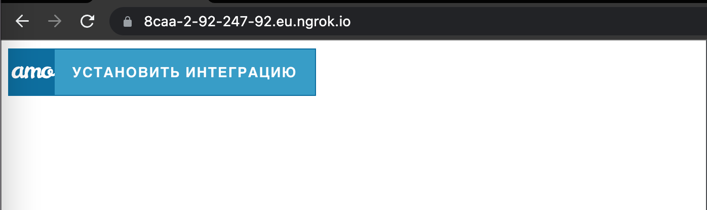
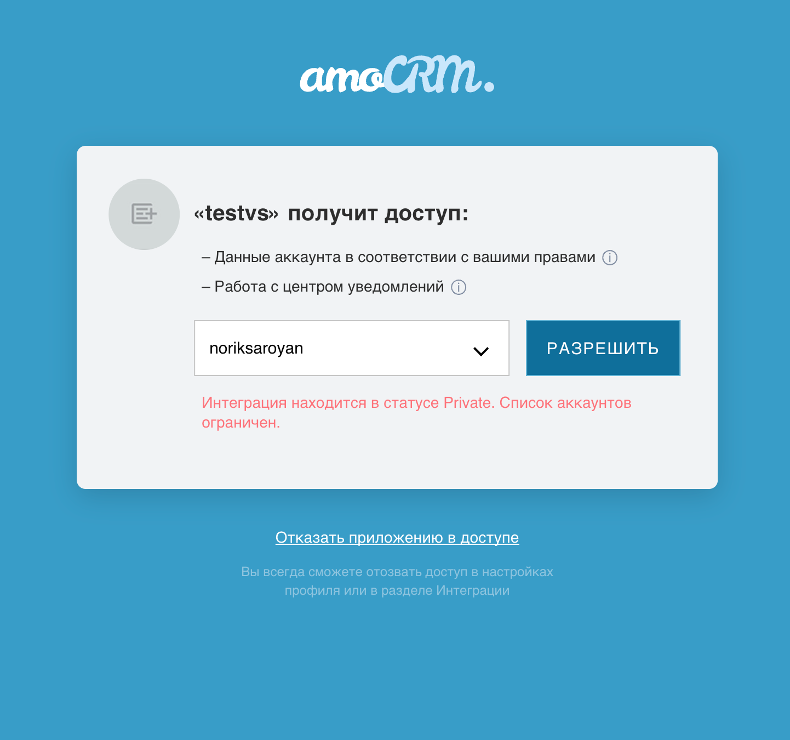
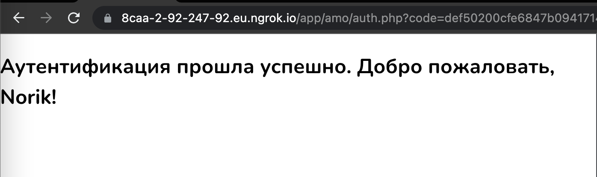

## Стэк:
- Php
- Laravel
- Docker
- amoCRM API Library
- amoCRM Provider для OAuth 2.0 Client

## Функционал  

- Сохранения токенов
- Обновление токенов 
- Интеграция с amoCrm

## Какую работу проделал
- Изучил документации amoCrm по ссылкам: https://github.com/amocrm/amocrm-oauth-client  https://github.com/amocrm/amocrm-api-php#%D0%BA%D0%BE%D0%BD%D1%81%D1%82%D0%B0%D0%BD%D1%82%D1%8B  https://www.amocrm.ru/developers/content/crm_platform/api-reference https://www.amocrm.ru/developers/content/digital_pipeline/site_visit
- Изучил документацию PHP по ссылке: https://www.php.net/docs.php
- Изпользовал полученные навыки и информацию из прочитанных документации в техническом задании.  
- Нашел команду, которая подготавливает рабочую среду с нужными минимальными зависимостями: Lavarel, Postgres 
 curl -s "https://laravel.build/data-sphera?with=pgsql&devcontainer" | bash
- Попробовал "PhpStorm": https://www.jetbrains.com/help/phpstorm/quick-start-guide-phpstorm.html
- Остановился на "Visual Studio Code": https://code.visualstudio.com/docs

## Использование
#### Как поднять приложение:
- Октрываем терминал
- Скачать репозиторий из бранча develop
- Зарегистрироваться на https://www.amocrm.ru/
- Запустить ngrok на порту 80 `ngrok http 80`, пусть адрес будет https://8caa-2-92-247-92.eu.ngrok.io
- Создать интеграцию с amoCrm <Публичный адрес ngrok>/app/amo/auth.php
- Скопировать clientId, ClientSecret, redirectURI. 

- В файле .env добавить строки
```
APP_URL=https://8caa-2-92-247-92.eu.ngrok.io
REDIRECT_URI=https://8caa-2-92-247-92.eu.ngrok.io/app/amo/auth.php
CLIENT_SECRET=xxx
CLIENT_ID=xxx
 ```
 Где APP_URL нужно заменить на адрес ngrok, чтобы заработал обратный редирект
 - `docker compose up`, поднимет приложение с зависимостями. Нужно открыть в браузере APP_URL

- Перед вами откроется главная страница сайта 


- Вам нужно нажать на кнопку 'Установить интеграцию' 


- После успешной аутентификации перенаправит на эту страницу. 


## Что осталось сделать
К сожалению, интеграция заняла слишком много времени. Но теперь приложение знает необходимые токены. 
Я узнал, как получить сделки из источника: https://github.com/amocrm/amocrm-api-php/blob/master/examples/leads_actions.php#L42
```
 try {
    $leadsCollection = $leadsService->get();
    $leadsCollection = $leadsService->nextPage($leadsCollection);
} catch (AmoCRMApiException $e) {
    printError($e);
    die;
}
```

```
 try {
    $leads = $apiClient->leads()->get();
} catch (AmoCRMApiException $e) {
    printError($e);
    die;
}
 ```